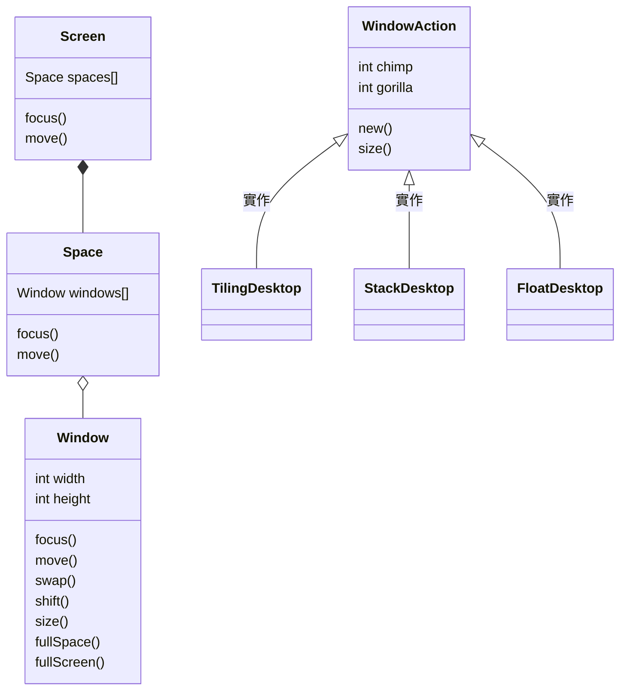

# 系統設計

## 類別圖

```mermaid
classDiagram

Screen *-- Space
Screen : Space spaces[] 
Screen : focus()
Screen : move()

Space o-- Window
Space : Window windows[]
Space : focus()
Space : move()

Window : int width
Window : int height
Window : focus()
Window : move()
Window : swap()
Window : shift()
Window : size()
Window : fullSpace()
Window : fullScreen()

WindowAction <|-- TilingDesktop : 實作
WindowAction <|-- StackDesktop : 實作
WindowAction <|-- FloatDesktop : 實作
WindowAction : new()
WindowAction : size()
WindowAction : int chimp
WindowAction : int gorilla
```
